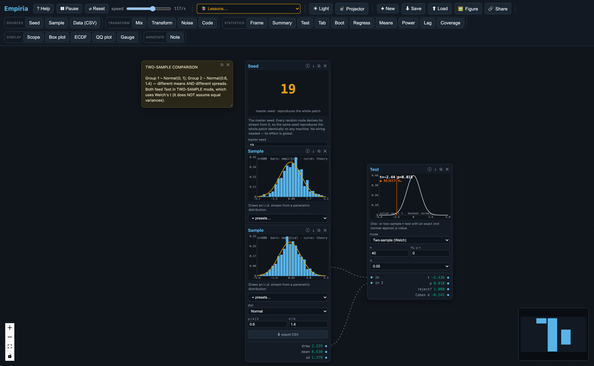
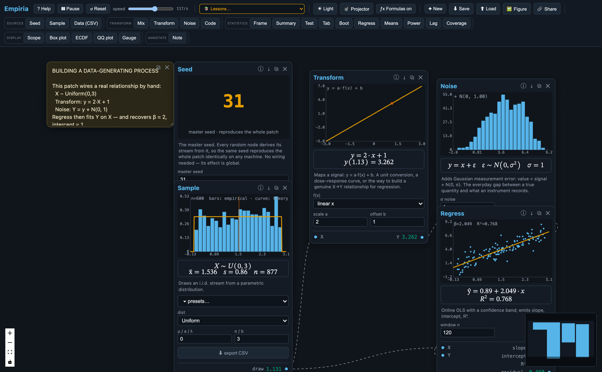
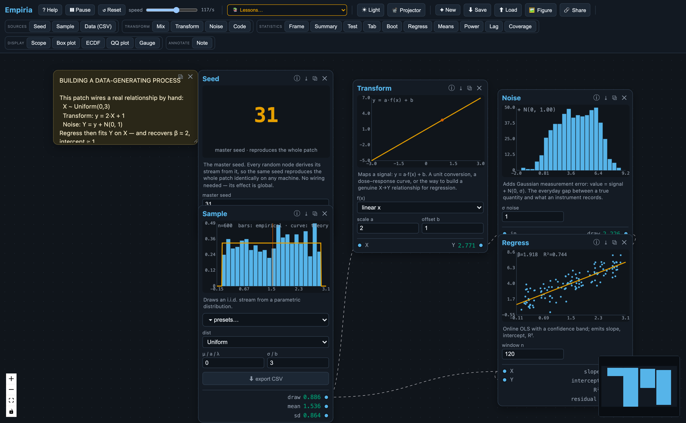
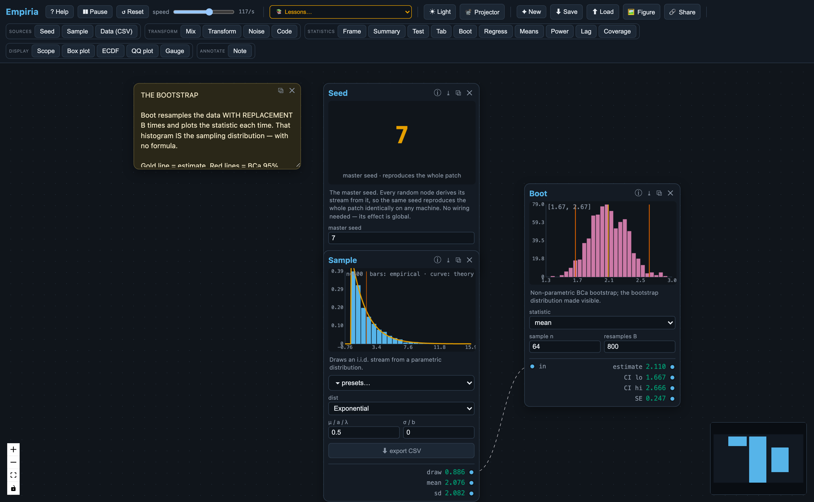

# Abstract

Introductory statistics is often taught through static equations and definitions delivered before the underlying quantities can be manipulated. We present Empiria, a free, open-source, browser-based environment that inverts this sequence. Drawing on the older tradition of analog computing, Empiria represents a statistical analysis as a manipulable dataflow graph. Students wire small computational modules together with cables on a canvas, and on each tick of a global clock every intermediate quantity updates in real time. The formula each module computes can be displayed alongside its visualization. Because the canvas is modular and customizable, students can extend, rewire, and rebuild an analysis rather than read it off a page. Empiria requires no installation, ships sixteen guided lessons and a tour, and exports figures, data, and reproducible patches. Its closed-form routines are verified against R to machine precision, and its randomized procedures against published reference values. Empiria is available at <https://kevinschoenholzer.com/empiria/>.

**Keywords:** Teaching Statistics; simulation-based inference; statistics
education; sampling distributions; bootstrap; reproducibility; educational
technology; dataflow

# Introduction

The case for reorganizing introductory statistics around simulation-based
reasoning, rather than closed-form normal-theory derivation, is by now well
established. Cobb (2007) argued that the curriculum had over-invested in
analytic derivations at the expense of randomization- and simulation-based
approaches in which the sampling distribution is built empirically before it
is named; the simulation-based-inference movement subsequently built curricula
around that idea (Rossman & Chance, 2014) and reported measurable gains in
students' reasoning about *p*-values and confidence intervals (Tintle et al.,
2015), and the GAISE College Report codified the
corresponding recommendations: foster active learning, use real data, integrate
technology, and emphasize statistical thinking (American Statistical Association, 2016). A sustained research literature documents *why* this is
hard: students struggle to form durable intuitions about sampling variability
and the sampling distribution of an estimator, and they benefit from
manipulating parameters and observing the consequences in real time (Chance et al., 2004; delMas et al., 2007; Garfield & Ben-Zvi, 2009).

The pedagogical principle is now mainstream; what remains uneven is the
*toolkit* through which it is delivered. The existing landscape is fragmented.
Sampling-distribution visualizers address sampling variability (Chance et al., 2004; delMas et al., 2007); TinkerPlots supports school-level exploratory
analysis (Konold & Lehrer, 2008) and CODAP extends this to data science for
younger learners (Finzer, 2013); NetLogo is the dominant agent-based-modeling
environment (Wilensky, 1999); StatKey supports a full simulation-based-inference
curriculum in the browser (Lock et al., 2021); and a large number of
single-purpose applets (for example, the *Rossman/Chance* collection and
*Seeing Theory*) and instructor-built R Shiny dashboards address specific
techniques. Each of these
tools is effective within its domain, but each is also *self-contained*: the
output of one cannot be piped into the next analytical step. This matters
because the workflow students must internalize (data-generating process →
sampling → estimation → inference → diagnostics) is exactly a *composable
pipeline*, and one-applet-per-concept tools render that pipeline invisible.

This article describes **Empiria**, an open-source, browser-based environment
that restores composition at the level of the platform. In Empiria a student
builds an analysis as a *dataflow graph*: small modules ("nodes") are connected
by cables, a global clock advances the computation, and the output of any node
is a signal that can be routed into any other. The entire inferential pipeline
therefore sits on a single screen, wired together, with every intermediate
quantity visible and manipulable as it updates. The contributions of the tool,
and of this article, are: (1) a composable, signal-flow interaction model for
simulation-based inference that makes the inferential workflow explicit; (2) a
live mathematical-notation view that renders each module's formula with the
current values substituted, tying symbolic form to direct manipulation; (3) a
zero-installation, cross-device implementation with sixteen ready-made lessons
and a guided tour; and (4) a verification methodology (exact numerical recipes,
deterministic seeding, and an automated test suite checked against R) that makes
the tool auditable rather than merely persuasive.

# Background and related tools

Empiria's nearest neighbors are the sampling-distribution visualizers studied
in the statistics-education literature (Chance et al., 2004; delMas et al., 2007), TinkerPlots (Konold & Lehrer, 2008), CODAP (Finzer, 2013), NetLogo
(Wilensky, 1999), the StatKey tools that accompany a simulation-based-inference
curriculum (Lock et al., 2021), the *Rossman/Chance* and *Seeing Theory* applet
collections, and the many instructor-authored R Shiny applications. These tools established
that dynamic, manipulable visualization supports the construction of sampling
intuitions, and Empiria builds directly on that finding.

Empiria differs from these precedents in three respects. First, it is a
*composable signal-flow environment* rather than a single-purpose application.
Even free, browser-based simulation tools such as StatKey present one analysis
per screen; in Empiria the output of any module is a signal that can be routed
into any other, so a parametric sampler can feed a sampling-window estimator,
which can feed a hypothesis test or a bootstrap, with no copy-paste or context
switch. Second,
it lowers the cost of authoring new teaching material: where a Shiny applet
requires fluency in R, HTML, and reactive programming, an Empiria activity is
assembled by wiring existing modules, and a new module is a single function
with a small parameter schema. Third, it treats numerical correctness and
reproducibility as first-class, testable properties (described below), so that
the tool can be audited by a skeptical instructor rather than taken on trust.
Empiria does not aim to replace analytic software such as R; it is a
complementary, simulation-first interface intended to make the elementary
operations of sampling, estimation, inference, and diagnosis directly
manipulable.

# Design

## The dataflow canvas

Empiria presents an infinite canvas on which the user places typed *nodes* and
connects their ports with *cables*. Every node exposes labelled input ports on
its left and output ports on its right; dragging a cable from an output to an
input establishes a dependency. A global clock advances the graph in
topological order, and on each tick every node reads its inputs, updates its
internal state, and renders a small visualization matched to the quantity it
computes. A complete analysis is thus laid out left to right as a visible chain
(source → transform → statistic → display), and every intermediate value is
observable as it changes (Figure 1). This interaction model is a deliberate
descendant of the dataflow and analog-computing traditions (visual
patch-and-cable environments and the differential analyzers that preceded
digital computation), in which the wiring *is* the program.

{width=100%}

**Figure 1.** A two-sample comparison assembled on the Empiria canvas. Two independent samplers, each drawing from its own population and showing a live histogram, feed a single test node that overlays the *t* reference distribution and reports the statistic and decision. The analysis is *built* as wired modules rather than invoked as a function call, so the data-generating process → sampling → estimation → inference workflow is laid out left to right with every intermediate quantity visible at once.

The clock speed is adjustable from roughly one tick per second (slow enough to
watch individual draws accumulate) to several thousand per second for rapid
convergence, with the current rate displayed. Light and dark themes, a
large-type "projector" mode for lecture rooms, and a colorblind-safe palette
support classroom use.

## The engine and reproducibility model

Empiria's computational core is implemented as a dependency-free TypeScript
engine that is independent of the user interface. All randomness derives from a
single seeded Mersenne-Twister generator (Matsumoto & Nishimura, 1998); the
standard `Math.random` is never used, because it is neither seedable nor
reproducible across browsers. Each stochastic node derives its own stream
deterministically from the master seed and its node identifier, so that adding
or removing a node does not perturb the others. A patch (the complete
description of the nodes, their parameters, the wiring, and the master
seed) serializes to a small JSON document that can be saved as a file or encoded
into a shareable URL; loading it reconstructs the simulation byte-for-byte on
any machine. Computation is performed in IEEE-754 double precision with no
platform-specific code paths, so a worked example is exactly reproducible
across operating systems and devices.

## Computational footprint

Empiria runs entirely in the browser. There is no server, and after the
initial download (a static bundle of roughly 0.4 MB, about 130 KB gzipped) it
runs offline. The numerical workload is light: a typical patch ticks well
above the interactive clock cap of a few thousand updates per second, so on
the low-power hardware typical of classrooms (Chromebooks, tablets) the
on-screen frame rate, not the arithmetic, is the limiting factor. Full
benchmark figures and a reproducible script are in the Supplementary Materials
(Appendix B).

## The module library

The modules are organized on the palette into five families (Table 1). Sources
generate or import data; transforms reshape a signal; statistics estimate,
test, or summarize; displays render a signal; and an annotation node lets the
instructor leave explanatory text that travels with the patch.

Table 1. *The Empiria module library.*

| Family | Modules |
|---|---|
| **Sources** | Seed (master seed), Sample (parametric distribution with real-world presets), Data (CSV import) |
| **Transform** | Mix (mixtures), Transform (`y = a·f(x)+b`), Noise (measurement error), Code (continuous → ordinal/Likert) |
| **Statistics** | Frame (mean/SD/SE), Summary (descriptives), Test (one/two-sample *t*), Tab (χ² and Cramér's V), Boot (BCa bootstrap), Regress (OLS), Means (sampling distribution of the mean), Power (power / Type-I error), Lag (autocorrelation), Coverage (confidence-interval coverage) |
| **Display** | Scope (time trace), Box (box plot), ECDF, QQ (normal quantile–quantile), Gauge (units readout) |
| **Annotate** | Note (editable, saved with the patch) |

Each statistic ships with a visualization designed for the concept it
represents: a histogram with a confidence band, a scatterplot with a fitted
line and prediction band, a null *t*-distribution with shaded rejection regions
and the normal approximation overlaid for contrast, a bootstrap distribution
annotated with its bias-correction diagnostics, and a confidence-interval
"coverage" display that stacks repeated intervals and colors those that miss
the true value.

# Pedagogical rationale

Empiria's design draws on established findings from the statistics-education and
mathematical-cognition literatures, which it operationalizes through the
principles below.

**Dynamic, manipulable visualization supports the construction of sampling
intuitions.** Students who manipulate parameters and watch sampling
distributions respond in real time develop more durable inferential intuitions
than those who encounter the same material as static figures (Chance et al., 2004; delMas et al., 2007; Garfield & Ben-Zvi, 2009; for a recent review, Gok & Goldstone, 2024). Empiria adopts this
throughout: every parameter is a control, every estimator is a live trace, and
every confidence interval is a band that visibly widens and narrows with the
sample.

**Concrete-to-abstract sequencing scaffolds inferential thinking.** Empiria's
patch grammar lets a procedure be *enacted* before it is *symbolized*. A
two-sample *t*-test is, in Empiria, a literal sequence of objects the student
wires together (two samplers, a sampling-window estimator on each branch, and a
test module that consumes both), so that when the algebraic formula is later
introduced, each symbol corresponds to a module the student has already
manipulated.

**Live notation ties manipulation to symbolic form.** A persistent difficulty
in statistics is that formulas stay inert: a student can read
*t* = (x̄ − μ₀)/(s/√n) without connecting any symbol to something they can
change. Empiria can render, beneath every node, the formula that node computes
in standard mathematical notation, written as a chained equality (the symbolic
expression, the current values substituted into it, and the result) that
updates on every tick (Figure 2). Manipulating the patch is therefore reflected
immediately in the equation: as a sample grows the student watches *s* shrink
and the denominator *s*/√*n* shrink with it; widening the gap x̄ − μ₀ drives the
*t*-statistic up; a Transform node shows *y* = 2·*x* + 1 evaluating a specific
input to a specific output beside the scatter it produces. The same patch can thus
be read two ways at once: picture-first for intuition, and notation-first for
formalism. The symbolic layer becomes a manipulable object rather than a
static artifact, which directly addresses the symbol-grounding gap the
concrete-to-abstract literature identifies. Because the notation is rendered
with the browser's native MathML, the feature adds no dependency and no
meaningful weight.

{width=100%}

**Figure 2.** The live-notation view (toggled on). Beneath each node, the
formula it computes is rendered in standard notation with the current values
substituted in: the Sample node shows its data-generating distribution and
running estimates, the Transform node shows *y* = 2·*x* + 1 evaluated at a
specific input, the Noise node shows *y* = *x* + ε with ε ∼ N(0, σ²), and the
Regress node reports the recovered ŷ = a + b·x and R². As the user changes a
parameter or rewires the graph, every equation updates on the next tick.

**Composition makes the inferential workflow visible.** Because the output of
any module is routable into any other, the data-generating process → sampling →
estimation → inference → diagnostics pipeline is a single wired chain rather
than a sequence of disconnected applets. This directly targets the structure
the reform literature identifies as the learning objective (Cobb, 2007; Tintle et al., 2015).

**Modular composition invites customization and independent exploration.**
Because activities are assembled from interchangeable parts rather than
delivered as fixed applets, a student is not confined to a scripted task: a
patch can be rewired, one distribution or estimator swapped for another, a
parameter nudged so that the downstream consequences propagate visibly, or
something the instructor never specified built from scratch (Figure 3). This open-ended,
constructionist mode of understanding by building and tinkering (Papert, 1980)
is supported directly by the dataflow canvas and by the analog-computing
intuition it inherits: a model is something one assembles from manipulable
parts and operates, not a result one reads off. The visual immediacy of the
per-node displays makes such exploration legible, because a change made
anywhere is immediately visible everywhere downstream.

{width=100%}

**Figure 3.** Building a data-generating process from interchangeable parts. A uniform predictor (Sample) is passed through a deterministic Transform ($y = 2x + 1$) and a Noise module before a Regress node recovers the relationship online and reports the fitted slope and intercept. Because the model is *assembled* rather than scripted, a student can swap the transform, change the amount of noise, or rewire the graph and watch every downstream view update. This is the build-and-tinker, analog-computing mode of working that the design is meant to invite.

These principles are operationalized in sixteen bundled lessons, each a
self-contained worksheet consisting of a patch plus an explanatory note, and a
four-step guided tour (Law of Large Numbers → bootstrap → *t*-test →
confidence-interval coverage) with previous/next navigation. The same modules
serve a range of audiences: a general-education class can place a sampler and a
sampling-window estimator and watch the standard error shrink as 1/√*n*; an
introductory course can add regression, testing, and the bootstrap as a live
picture of the workflow students will later carry out in R; and a graduate
methods seminar can use the platform to interrogate small-sample behavior or to
compare bootstrap intervals against analytic ones. What differs across
audiences is the depth at which the underlying mathematics is examined, not the
tool.

# Teaching and learning context

Empiria is designed for the practising teacher, not the developer. Because it
runs in the browser with no installation and ships with ready-to-use lesson
patches, the activation cost is low: opening a lesson from the menu and either
projecting it on a screen or sharing the link is enough to start using it.

**Audiences.** The tool serves three broad audiences with the same modules but
different depth of treatment. *General-education and first quantitative
courses* (a one-semester statistics requirement for non-majors, for example)
can use the sampling-distribution, law-of-large-numbers, and coverage
activities as concept-building demonstrations without dwelling on the algebra.
*Introductory undergraduate statistics* across the social and life sciences
builds the inferential chain (sampling, estimation, *t*-tests, confidence
intervals, the bootstrap, regression) with the same modules students will
later use in R or Python; the live picture serves as the intuition that the
formal treatment then names. *Methods courses for advanced undergraduate and
postgraduate students* use the canvas to interrogate small-sample behaviour,
Type-I error and power, model misspecification through the Transform → Noise →
Regress chain, and the bootstrap's coverage properties.

**Modes of use.** The lessons are short enough to drop into a 50–75-minute
class and flexible enough to support several formats:

- *In-lecture demonstration* (5–15 min): the instructor opens a patch on a
  projector and steers it through the concept; the built-in *projector* mode
  enlarges the on-panel text for a lecture room.
- *Computer-lab activity* (30–75 min): students each open the same lesson,
  follow the prompts in the embedded Note, modify a parameter or two, and
  report back.
- *Pre-class warm-up or homework* (10–30 min): the instructor shares a patch
  URL; students open it on a laptop, tablet, or Chromebook and bring a
  screenshot or an answered prompt to class.
- *Group exploration*: small groups assemble a patch from a specification
  ("build a data-generating process whose regression slope is hidden by the
  noise") and compare their solutions.

**Pacing and preparation.** A typical activity runs 10–45 minutes in class;
preparation for an instructor familiar with the tool is on the order of ten
minutes per lesson, because lesson patches load with explanatory Notes and
sensible defaults. No software installation is required on lab machines, and
patches saved as shareable links travel as ordinary URLs. The development
context of this article is a methods-teaching role in the social sciences (the
author is a postdoctoral researcher at the Institute of Communication and
Public Policy at USI), but the tool is discipline-agnostic: the same lessons
serve any course in which sampling, inference, and regression are introduced.

# Illustrative classroom use

Each bundled lesson loads as a self-contained worksheet: a patch wired on the
canvas plus an explanatory Note that states the goal, what to look at, and
what to try. The six lessons below show the range; for each we give the
typical audience, the mode of use, an approximate duration, what the student
does and observes, and the misconception or learning objective it targets.

**Sampling-distribution and the law of large numbers** (general-education or
introductory undergraduate; in-lecture demonstration or pre-class warm-up;
10–15 minutes). A Seed feeds a Sample drawing from a Normal population into a
Frame in growing mode, which displays the running mean and standard error. As
the clock runs, the mean settles onto the true value and the standard error
contracts as 1/√*n*. Students then lower the population SD or change the seed
and re-run: the *shape* of the convergence is the same, the specific path
differs. The activity targets the common misconception that one sample's mean
either "is" or "is not" close to the truth, and gives students an embodied
feel for sampling variability and the role of *n*.

**What "95% confidence" really means** (introductory undergraduate or methods;
lab or homework; 15–25 minutes). A Coverage node repeats the same experiment
again and again: each repetition draws a fresh sample, builds a *t*-interval
for the mean, and asks whether the true value falls inside. The display stacks
the intervals and colours those that miss. After a few hundred repetitions the
empirical coverage approaches the nominal 95%. The activity gives an
operational meaning to the confidence guarantee, a property of the *procedure*
rather than of any one interval, and directly confronts the textbook
misreading that "there is a 95% chance the true mean is in *this* interval."

**Bootstrap sampling distribution** (introductory undergraduate or methods;
lab or homework; 20–30 minutes). A Sample drawn from a skewed (exponential)
parent feeds a Boot node that resamples with replacement and shows the
bootstrap distribution of the chosen statistic, annotated with its
bias-corrected and accelerated interval (Figure 4) (Efron, 1987; Hesterberg,
2015). Students change the statistic from mean to median to standard
deviation, change *n* and *B*, and discuss how the bootstrap distribution
narrows. The sampling distribution is now something a student constructed and
watched form, rather than something a textbook names without showing.

**Comparing two groups with Welch's *t*** (introductory undergraduate or
methods; lab or homework; 25–40 minutes). Two independent Sample nodes draw
from Normal populations with potentially different means and spreads; each
feeds a histogram and a Test node configured for Welch's two-sample *t*
(Figure 1). Students manipulate the group means and spreads and watch the *t*
statistic, the *p*-value, and the reject/retain decision update. The activity
makes the link between effect size, sample size, and decision concrete, and
sets up a follow-up discussion of false-positive and false-negative risks.

**Building a data-generating process from interchangeable parts** (methods
seminar or advanced undergraduate; lab; 30–45 minutes). A uniform Sample is
passed through a Transform applying *y* = *a*·*x* + *b*, then through a Noise
module that adds normal measurement error, and finally into a Regress node
that fits OLS online (Figure 3). Students vary *a*, *b*, and σ and watch the
recovered slope and intercept hover near the truth while R² rises and falls.
They then swap the Transform for a square or a sigmoid and discuss how a
linear model behaves when the generating process is not, providing an early,
visual introduction to the modelling assumptions students will later read about
formally.

**False positives when nothing is going on** (methods seminar or postgraduate;
lab or homework; 15–25 minutes). Two identical Sample nodes feed a Power node
that repeatedly runs a Welch *t* and tallies the rejection rate. With both
populations identical, the rejection rate sits near α. Students then change α
from 0.01 to 0.10 and watch the false-positive rate track it. The activity
makes the meaning of "Type-I error rate" something watched rather than asserted,
and provides natural setup for a later session on multiple-testing corrections.

In each case the patch is seeded, so an instructor can distribute it, have
students run it, and be confident that every result reproduces across
machines. Ten further lessons in the same format cover Likert-coding, a
mixture of two distributions, the central limit theorem from a skewed parent,
QQ plots, exploratory data analysis on an imported CSV, and others; the full
list is in the Supplementary Materials (Appendix F).

{width=100%}

**Figure 4.** Simulation made visible. A sample drawn from a skewed (exponential) parent is resampled with replacement by the Boot module, whose histogram (magenta) is the bootstrap sampling distribution of the mean, annotated with a bias-corrected and accelerated interval. The sampling distribution is *constructed* empirically and watched as it forms, before any closed-form expression is introduced.

# Informal feedback and design evolution

The design has been shaped by informal practitioner input gathered during
development. Students who tried the running application, and a small set of
colleagues teaching introductory statistics who responded to an open call for
impressions on the tool, raised two recurring themes that influenced both the
manuscript and the tool itself.

The first theme was *applicability*: how the tool maps onto a specific
course's teaching goals, where the example use cases sit, and how an
instructor would weave a lesson into existing teaching. In response, the
manuscript was rewritten to foreground a *Teaching and learning context*
section (audiences, modes of use, pacing, preparation) and to expand
*Illustrative classroom use* into the six detailed lesson walkthroughs above,
each stating its intended audience, the kind of session it suits, an
approximate duration, and the misconception or learning objective it targets.

The second theme was the *activation cost* of a node-and-cable interface for
first-time users: how to get started, where to look, what to try first. In
response, the application gained a short *guided tour* that walks a new user
through the Law of Large Numbers, the bootstrap, the *t*-test, and
confidence-interval coverage in four steps, lowering the cost of engagement
for instructors and students encountering the canvas for the first time.
Other recurring observations included appreciation for the live visual
feedback as an alternative pathway into statistical ideas, and for the live
mathematical-notation view (Figure 2) for its balance of mathematical rigor
and a playful, manipulable mode of working.

We treat this informal input as *design evidence*: it has shaped the tool and
the manuscript, and explaining how is part of the article's transparency.
Because the feedback was solicited as service-improvement input on the tool
rather than as human-subjects research, no identifying or quantified data are
collected or reported here, and observations are presented in aggregate,
thematic form only. We do not present these themes as evidence of learning
outcomes; that is a separate question, taken up in *Limitations and future
work*.

# Numerical correctness and reproducibility

## Verifying the numerics

Because the pedagogy depends on the displayed numbers being correct rather than
merely plausible, Empiria treats verification as part of the artifact. Where
introductory tooling has often relied on normal-theory approximations, Empiria
computes closed-form quantities with their exact numerical recipes: the
two-tailed Student-*t* and χ² tail probabilities are evaluated through the
regularized incomplete beta and gamma functions using continued-fraction
expansions (Press et al., 2007); confidence-interval critical values use the
exact *t* quantile rather than the *z* ≈ 1.96 approximation; and bootstrap
intervals are bias-corrected and accelerated (Efron, 1987).

These routines are checked by an automated test suite that compares each result
against R to machine precision, covering the incomplete beta and gamma
functions, Student-*t* probabilities and critical values, the normal CDF and
quantile, one-sample and Welch two-sample *t*-tests, ordinary least squares,
the contingency-table χ² and Cramér's V, autocorrelation, and the descriptive
moments. The Mersenne-Twister generator is checked against its canonical test
vector. The suite also verifies system-level properties: byte-identical
reproduction under a fixed seed, the contraction of the standard error under
the Law of Large Numbers, approximately nominal (95%) confidence-interval
coverage, and a Type-I error rate near α under the null. An accompanying R
script regenerates every reference value independently, so a reviewer can
confirm the reference values themselves rather than only the tool's
self-consistency, and a verification document maps each routine to its
algorithm, citation, reference command, and test. Finally, because a patch is
seeded JSON, a student can export any node's data to CSV and reproduce the
statistic in R as an external check; the same patch and seed yield an identical
export on any machine.

## Development with AI coding assistance

Empiria's implementation was carried out with the help of AI coding assistants
(large language models used as programming aids). We disclose this as a matter
of scholarly practice, and because it bears on a legitimate concern: software
produced with substantial machine assistance may contain plausible-looking but
incorrect numerical behavior, and a reader is right to ask whether the
displayed statistics can be trusted. The answer here is methodological rather
than rhetorical. The trustworthiness of Empiria's outputs does not rest on the
provenance of the code that produces them; it rests on an external verification
regime that is independent of how the code was written.

Concretely, every numerical routine is checked against an authoritative
reference implementation: R's statistical functions (`pt`, `qt`, `pchisq`,
`pnorm`, `qnorm`, `t.test`, `lm`, `chisq.test`, `acf`, `quantile`), the `boot`
package for the BCa interval, and the canonical Mersenne-Twister test vector.
Agreement is to machine precision, with Monte-Carlo tolerances stated
explicitly where resampling is involved. Those reference values are produced by an
independent R script that a reviewer can rerun and compare against the literals
asserted in the test suite, so the check confirms the reference values
themselves rather than only the tool's internal self-consistency. A test that
compares to R cannot be satisfied by code that is merely persuasive: it passes
only if the number is right, whoever or whatever wrote the code.

We also separate authorship from correctness. The statistical methods, the
choice of exact recipes over normal-theory approximations, the pedagogical
claims, and the interpretation of every result were specified, reviewed, and
are vouched for by the author; the AI tools accelerated implementation, they did
not make statistical decisions, and the author takes full responsibility for
the software and the manuscript. Because the full audit trail maps each routine
to its algorithm, citation, reference command, and test, and because the entire
suite runs from three commands, any reviewer can reproduce the verification in
minutes rather than taking our word for it.

# Data and code availability

Empiria is released under the GPL-3.0 license and runs in any modern browser
with no installation. The live application is at
<https://kevinschoenholzer.com/empiria/>; the source code, the automated test
suite, the verification materials, the bundled lessons, and the documentation
are in the public repository at <https://github.com/kevisc/empiria>. The exact
version described here is tagged as v2.1.0 in the repository and archived on
Zenodo (DOI: <https://doi.org/10.5281/zenodo.20413213>), so that the reviewed
software remains citable independently of later development. The figures in this
article are screenshots of the running application; the patches that generate
them are included among the bundled lessons.

# Limitations and future work

Empiria's contribution is a design: an interaction model grounded in
established findings about manipulable visualization and simulation-based
reasoning, paired with auditable numerics and reproducible, shareable patches.
Its defining affordances are visual, analog-computing-inspired, and modular, and
they are intended to support guided activities as well as the open-ended,
learner-directed exploration in which a student customizes a patch, substitutes
one component for another, and reaches a result by building rather than by
following a script.

We should be explicit about what this article does not establish. It offers no
evidence of learning gains from Empiria itself: the pedagogical claims above are
design rationale, grounded in prior findings about related tools, and whether
they translate into measurable outcomes is an open empirical question. Reviews
of simulation tools are a useful corrective here: interactive visualization
does not by itself guarantee understanding: students can watch a sampling
distribution narrow and still misread it as a distribution of individual
values. The surrounding tasks and design details do much of the work (Gok &
Goldstone, 2024). The affordances are available to instructors and students
today, but their educational value remains to be demonstrated.

A formal evaluation of learning outcomes is a possible future extension, but
we have not undertaken one. Empiria has not been studied in a classroom or
experimental setting, and we therefore make no claim about its effect on
student understanding, retention, or transfer. What we can claim, and what we
have tried to ensure, is that the tool has been shaped toward concrete
learning goals and the practitioner needs articulated during its development
(reported above in *Informal feedback and design evolution*), and that its
numerical outputs are correct and independently verifiable: closed-form
routines checked against R to machine precision, the bootstrap validated by
its coverage behavior, and an automated test suite that any reviewer can
rerun in minutes (full detail in *Numerical correctness and reproducibility* and the
Supplementary Materials). What an instructor needs in order to trust the
numbers Empiria displays is therefore on offer; what would be needed to claim
that an Empiria-augmented lesson moves a learning-outcome measure is a
controlled study, which we leave to future work.

Two practical considerations are worth noting for adopters. Because a
node-and-cable interface is initially unfamiliar, the bundled guided tour and
lesson patches are designed to lower the activation cost and to give students a
scaffold from which to begin tinkering; and because the modules are visually
engaging, the suggested classroom integration is additive to, rather than a
replacement for, a standard analytic workflow. On the technical side,
confidence intervals for proportions currently use the normal (Wald) form, and
the bootstrap is validated by its coverage behavior and by exact tests of its
components rather than by a value-for-value match to a specific resampling
implementation.

# Conclusion

Empiria operationalizes the central recommendation of the statistics-education
reform literature (that students build the sampling distribution before they
name it) by making the inferential workflow a composable, manipulable object
rather than a sequence of disconnected applets. By pairing that interaction
model with exact, independently auditable numerics and reproducible, shareable
patches, it aims to be trustworthy as well as legible: a tool a student can
learn from and an instructor can verify.

# Disclosure statement

The author reports no competing interests. No funding supported this work.
The informal practitioner feedback referenced in this article was solicited as
service-improvement input on the tool rather than as human-subjects research;
no identifying information was collected, and observations are reported in
aggregate, thematic form only. AI-based coding assistants (large language
models) were used as programming aids during development of the software. All statistical methods and numerical
results were specified by the author and verified against independent reference
implementations, as described in *Numerical correctness and reproducibility*;
the author takes full responsibility for the content of the software and the
manuscript.

# References

1. American Statistical Association, Guidelines for Assessment and Instruction in Statistics Education (GAISE) College Report 2016, *American Statistical Association*, 2016. <https://www.amstat.org/education/gaise>

2. B. Chance, R. delMas, J. Garfield, Reasoning about sampling distributions, in: D. Ben-Zvi, J. Garfield (Eds.), *The Challenge of Developing Statistical Literacy, Reasoning, and Thinking*, Springer, 2004, pp. 295–323. <https://doi.org/10.1007/1-4020-2278-6_13>

3. G. W. Cobb, The introductory statistics course: A Ptolemaic curriculum?, *Technology Innovations in Statistics Education*, 1(2007). <https://doi.org/10.5070/T511000028>

4. R. delMas, J. Garfield, A. Ooms, B. Chance, Assessing students' conceptual understanding after a first course in statistics, *Statistics Education Research Journal*, 6(2007), 28–58. <https://doi.org/10.52041/serj.v6i2.483>

5. B. Efron, Better bootstrap confidence intervals, *Journal of the American Statistical Association*, 82(1987), 171–185. <https://doi.org/10.1080/01621459.1987.10478410>

6. W. Finzer, The data science education dilemma, *Technology Innovations in Statistics Education*, 7(2013). <https://doi.org/10.5070/T572013891>

7. J. Garfield, D. Ben-Zvi, Helping students develop statistical reasoning: Implementing a statistical reasoning learning environment, *Teaching Statistics*, 31(2009), 72–77. <https://doi.org/10.1111/j.1467-9639.2009.00363.x>

8. S. Gok, R. L. Goldstone, How do students reason about statistical sampling with computer simulations? An integrative review from a grounded cognition perspective, *Cognitive Research: Principles and Implications*, 9(2024), 33. <https://doi.org/10.1186/s41235-024-00561-x>

9. T. C. Hesterberg, What teachers should know about the bootstrap: Resampling in the undergraduate statistics curriculum, *The American Statistician*, 69(2015), 371–386. <https://doi.org/10.1080/00031305.2015.1089789>

10. C. Konold, R. Lehrer, Technology and mathematics education: An essay in honor of Jim Kaput, in: L. D. English (Ed.), *Handbook of International Research in Mathematics Education*, 2nd ed., Routledge, 2008.

11. R. H. Lock, P. F. Lock, K. Lock Morgan, E. F. Lock, D. F. Lock, *Statistics: Unlocking the Power of Data*, 3rd ed., Wiley, 2021. StatKey: <https://www.lock5stat.com/statkey>.

12. M. Matsumoto, T. Nishimura, Mersenne Twister: A 623-dimensionally equidistributed uniform pseudo-random number generator, *ACM Transactions on Modeling and Computer Simulation*, 8(1998), 3–30. <https://doi.org/10.1145/272991.272995>

13. S. Papert, *Mindstorms: Children, Computers, and Powerful Ideas*, Basic Books, 1980.

14. W. H. Press, S. A. Teukolsky, W. T. Vetterling, B. P. Flannery, *Numerical Recipes: The Art of Scientific Computing*, 3rd ed., Cambridge University Press, 2007.

15. A. Rossman, B. Chance, Using simulation-based inference for learning introductory statistics, *WIREs Computational Statistics*, 6(2014), 211–221. <https://doi.org/10.1002/wics.1302>

16. N. Tintle, B. Chance, G. Cobb, S. Roy, T. Swanson, J. VanderStoep, Combating anti-statistical thinking using simulation-based methods throughout the undergraduate curriculum, *The American Statistician*, 69(2015), 362–370. <https://doi.org/10.1080/00031305.2015.1081619>

17. U. Wilensky, *NetLogo*, Center for Connected Learning and Computer-Based Modeling, Northwestern University, 1999. <http://ccl.northwestern.edu/netlogo/>
